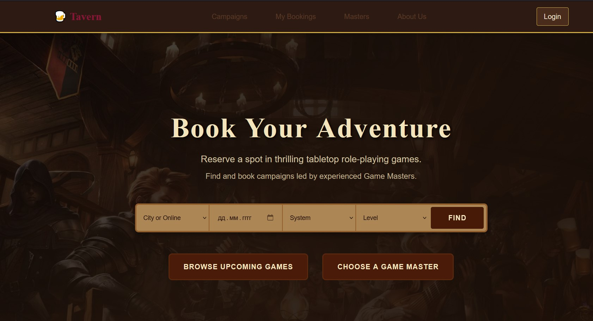

# 🎲 DnD Tavern — Your Gateway to Tabletop RPG Adventures

A modern, full-stack marketplace application for discovering, booking, and managing tabletop RPG campaigns. Whether you're a player looking for your next adventure or a Game Master ready to lead epic quests, DnD Tavern brings the community together in one seamless platform.

Built with a robust **ASP.NET Core** backend and a dynamic **Angular** frontend, this project showcases enterprise-grade architecture with clean code principles, containerization, and CI/CD deployment to AWS.



---

## ✨ Key Features

### For Players
- **🔍 Campaign Discovery** — Browse through a catalog of exciting D&D campaigns with rich details, schedules, and Game Master profiles
- **📅 Smart Booking System** — Reserve your spot in upcoming sessions with real-time slot availability
- **⭐ Review & Rate** — Share your experience and help others find the best Game Masters
- **👤 User Dashboard** — Manage your bookings, view upcoming sessions, and track your adventure history

### For Game Masters
- **🎭 Campaign Management** — Create and manage your campaigns with detailed descriptions, schedules, and pricing
- **📊 GM Dashboard** — Monitor bookings, manage slots, and interact with your player base
- **💰 Flexible Pricing** — Set your rates and manage campaign availability

### Technical Highlights
- **🔐 JWT Authentication** — Secure authentication with Google OAuth integration
- **📱 Responsive Design** — Beautiful UI built with Angular 20 and Bootstrap 5
- **🐳 Docker Ready** — Fully containerized for easy deployment
- **🚀 CI/CD Pipeline** — Automated builds and deployments via GitHub Actions to AWS Elastic Beanstalk
- **📖 API Documentation** — Complete Swagger/OpenAPI documentation for all endpoints
- **🏗️ Clean Architecture** — Separation of concerns with Domain, Application, Infrastructure, and API layers

---

## 🔌 API Documentation

The backend exposes a comprehensive RESTful API documented with **Swagger/OpenAPI**.

### Accessing Swagger UI

When running the backend locally in development mode:

**URL:** `http://localhost:5000/swagger`

The Swagger UI provides:
- Interactive API exploration
- Request/response schemas
- Authentication testing with JWT tokens
- Try-it-out functionality for all endpoints

### Available API Endpoints

| Resource | Endpoints | Description |
|----------|-----------|-------------|
| **Campaigns** | `/api/campaigns` | Browse, search, and manage D&D campaigns |
| **Masters** | `/api/masters` | Game Master profiles and information |
| **Bookings** | `/api/bookings` | Create and manage session bookings |
| **Users** | `/api/users` | User authentication and profile management |

All endpoints return standardized responses wrapped in a custom middleware for consistent error handling and data formatting.

---

## 🚀 Quick Start

### Prerequisites

#### Backend Requirements
- [.NET 8.0 SDK](https://dotnet.microsoft.com/download/dotnet/8.0) or later
- [PostgreSQL](https://www.postgresql.org/) database (or use Docker)
- Docker & Docker Compose (for containerized setup)

#### Frontend Requirements
- [Node.js 20.x](https://nodejs.org/) or later
- npm (comes with Node.js)

---

## 🐳 Docker Deployment (Recommended)

The easiest way to run the entire stack is using Docker Compose:

### 1. Clone the Repository
```bash
git clone https://github.com/Barik766/DnDAgency.git
cd DnDAgency
```

### 2. Configure Environment Variables

Create a `.env` file in the root directory with the following variables:

```env
# Database Configuration
RDS_HOSTNAME=your-postgres-host
RDS_PORT=5432
RDS_DB_NAME=dndagency
RDS_USERNAME=your-db-user
RDS_PASSWORD=your-db-password

# JWT Settings
JwtSettings__Key=your-super-secret-jwt-key-minimum-32-characters
JwtSettings__Issuer=https://yourdomain.com
JwtSettings__Audience=https://yourdomain.com

# Google OAuth (optional)
GoogleOAuth__ClientId=your-google-client-id
GoogleOAuth__ClientSecret=your-google-client-secret
```

### 3. Start the Application
```bash
docker-compose up --build
```

The application will be available at:
- **Frontend:** http://localhost:80
- **Backend API:** http://localhost:5000
- **Swagger UI:** http://localhost:5000/swagger

---

## 💻 Local Development Setup

### Backend Setup

1. **Navigate to the backend directory:**
   ```bash
   cd DnDAgency
   ```

2. **Restore dependencies:**
   ```bash
   dotnet restore
   ```

3. **Update connection string in `appsettings.Development.json`:**
   ```json
   {
     "ConnectionStrings": {
       "DefaultConnection": "Host=localhost;Port=5432;Database=dndagency;Username=postgres;Password=yourpassword"
     }
   }
   ```

4. **Run database migrations:**
   ```bash
   dotnet ef database update --project DnDAgency.Infrastructure
   ```
   
   If `dotnet ef` is not installed:
   ```bash
   dotnet tool install --global dotnet-ef
   ```

5. **Run the backend:**
   ```bash
   dotnet run --project DnDAgency.Api.csproj
   ```
   
   The API will be available at `https://localhost:5001` or `http://localhost:5000`

### Frontend Setup

1. **Navigate to the frontend directory:**
   ```bash
   cd dnd-tavern
   ```

2. **Install dependencies:**
   ```bash
   npm ci
   ```

3. **Run the development server:**
   ```bash
   npm start
   ```
   
   The Angular app will be available at `http://localhost:4200`

4. **Build for production:**
   ```bash
   npm run build
   ```

---

## 📚 Example API Usage

Here are some example API requests to get you started:

### 1. Get All Campaigns
```bash
curl -X GET "http://localhost:5000/api/campaigns" -H "accept: application/json"
```

**Response:**
```json
{
  "success": true,
  "data": [
    {
      "id": "3fa85f64-5717-4562-b3fc-2c963f66afa6",
      "title": "Lost Mines of Phandelver",
      "description": "A classic D&D adventure for new players",
      "system": "D&D 5e",
      "level": "Beginner",
      "pricePerSession": 15.00,
      "masterId": "1234-5678-90ab-cdef",
      "masterName": "John the DM"
    }
  ]
}
```

### 2. Register a New User
```bash
curl -X POST "http://localhost:5000/api/users/register" \
  -H "Content-Type: application/json" \
  -d '{
    "username": "adventurer123",
    "email": "adventurer@example.com",
    "password": "SecurePass123!"
  }'
```

### 3. Get Campaign Details
```bash
curl -X GET "http://localhost:5000/api/campaigns/{campaignId}" \
  -H "accept: application/json"
```

### 4. Create a Booking (Requires Authentication)
```bash
curl -X POST "http://localhost:5000/api/bookings" \
  -H "Authorization: Bearer YOUR_JWT_TOKEN" \
  -H "Content-Type: application/json" \
  -d '{
    "slotId": "slot-guid-here",
    "userId": "user-guid-here"
  }'
```

---

## 🛠️ For Developers

### Project Structure

```
DnDAgency/
├── DnDAgency/                    # API Layer (ASP.NET Core Web API)
│   ├── Controllers/              # API Controllers
│   ├── Filters/                  # Custom action filters
│   ├── Middleware/               # Custom middleware (auth, logging, error handling)
│   └── Program.cs                # Application entry point
│
├── DnDAgency.Domain/             # Domain Layer (Entities & Interfaces)
│   ├── Entities/                 # Domain models (Campaign, Master, User, Booking, etc.)
│   └── Interfaces/               # Repository interfaces
│
├── DnDAgency.Application/        # Application Layer (Business Logic)
│   ├── DTOs/                     # Data Transfer Objects
│   ├── Interfaces/               # Service interfaces
│   └── Services/                 # Business logic implementation
│
├── DnDAgency.Infrastructure/     # Infrastructure Layer (Data Access)
│   ├── Data/                     # DbContext and configuration
│   ├── Repositories/             # Repository implementations
│   ├── Migrations/               # EF Core migrations
│   └── UnitOfWork/               # Unit of Work pattern
│
├── dnd-tavern/                   # Frontend (Angular 20)
│   ├── src/
│   │   ├── app/
│   │   │   ├── core/             # Core features (auth, campaigns, bookings, etc.)
│   │   │   └── shared/           # Shared components and services
│   │   └── stylesFolder/         # SCSS styles, design tokens
│   ├── Dockerfile                # Frontend Docker configuration
│   └── nginx.conf                # Nginx reverse proxy config
│
├── Dockerfile                    # Backend Docker configuration
├── docker-compose.yml            # Multi-container orchestration
└── .github/workflows/            # CI/CD pipeline configuration
```

### Architecture Pattern

The backend follows **Clean Architecture** principles:

- **Domain Layer:** Pure business logic and entities (no dependencies)
- **Application Layer:** Use cases and business rules (depends on Domain)
- **Infrastructure Layer:** Data access, external services (depends on Domain & Application)
- **API Layer:** Controllers, filters, middleware (depends on all layers)

### Key Technologies

**Backend:**
- ASP.NET Core 8.0
- Entity Framework Core
- PostgreSQL
- JWT Authentication
- Swagger/OpenAPI

**Frontend:**
- Angular 20
- RxJS
- Bootstrap 5
- SCSS

**DevOps:**
- Docker & Docker Compose
- GitHub Actions
- AWS Elastic Beanstalk
- Nginx

### Running Tests

```bash
# Backend tests (when available)
cd DnDAgency
dotnet test

# Frontend tests
cd dnd-tavern
npm test
```

### Database Migrations

Create a new migration:
```bash
dotnet ef migrations add MigrationName --project DnDAgency.Infrastructure --startup-project DnDAgency
```

Apply migrations:
```bash
dotnet ef database update --project DnDAgency.Infrastructure --startup-project DnDAgency
```

---

## 🗺️ Roadmap & Future Enhancements

We're continuously improving DnD Tavern! Here's what's on the horizon:

### Upcoming Features
- [ ] **Real-time Chat** — Live messaging between players and Game Masters using SignalR
- [ ] **Advanced Search & Filters** — Filter campaigns by system, level, price range, location, and more
- [ ] **Calendar Integration** — Sync bookings with Google Calendar and other calendar apps
- [ ] **Payment Integration** — Stripe/PayPal integration for seamless payment processing
- [ ] **Session Notes & Documents** — Upload and share campaign materials, character sheets, and session notes
- [ ] **Virtual Tabletop Integration** — Direct links to Roll20, Foundry VTT, and other platforms

### Architecture Improvements
- [ ] **Microservices Migration** — Break monolith into specialized services (Auth, Campaigns, Bookings, Notifications)
- [ ] **Message Queue** — Implement RabbitMQ/Azure Service Bus for async operations
- [ ] **Caching Layer** — Redis integration for improved performance
- [ ] **GraphQL API** — Alternative query language for more flexible data fetching
- [ ] **Event Sourcing** — Track all changes to bookings and campaigns with CQRS pattern

### Developer Experience
- [ ] **Unit & Integration Tests** — Comprehensive test coverage
- [ ] **API Versioning** — Support multiple API versions for backward compatibility
- [ ] **Kubernetes Deployment** — Container orchestration with K8s
- [ ] **Monitoring & Logging** — Application Insights, ELK stack integration

---

## 🤝 Contributing

We welcome contributions! Whether it's bug fixes, new features, or documentation improvements, your help makes DnD Tavern better for everyone.

### How to Contribute

1. Fork the repository
2. Create a feature branch (`git checkout -b feature/amazing-feature`)
3. Commit your changes (`git commit -m 'Add amazing feature'`)
4. Push to the branch (`git push origin feature/amazing-feature`)
5. Open a Pull Request

---

## 📄 License

This project is available for educational and portfolio purposes. Feel free to use it as inspiration for your own projects!

---

## 🌟 Acknowledgments

Built with passion for the tabletop RPG community. Special thanks to all dungeon masters and players who make every session memorable!

---

## 📧 Contact

**Project Maintainer:** [Barik766](https://github.com/Barik766)

**Live Demo:** [Coming Soon]

**Issues & Support:** [GitHub Issues](https://github.com/Barik766/DnDAgency/issues)

---

<div align="center">
  <strong>Roll for initiative and start your adventure today! 🎲⚔️</strong>
</div>
